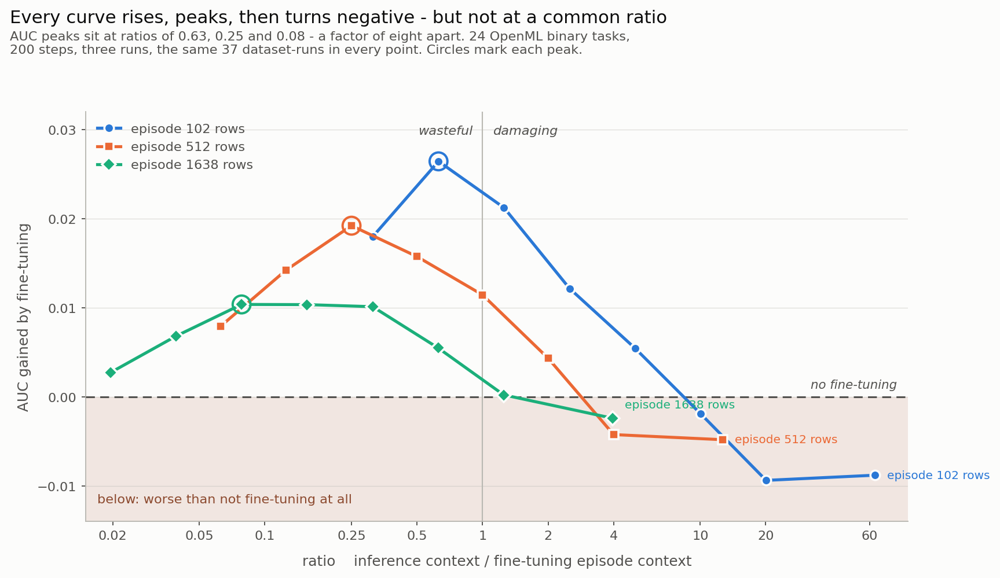
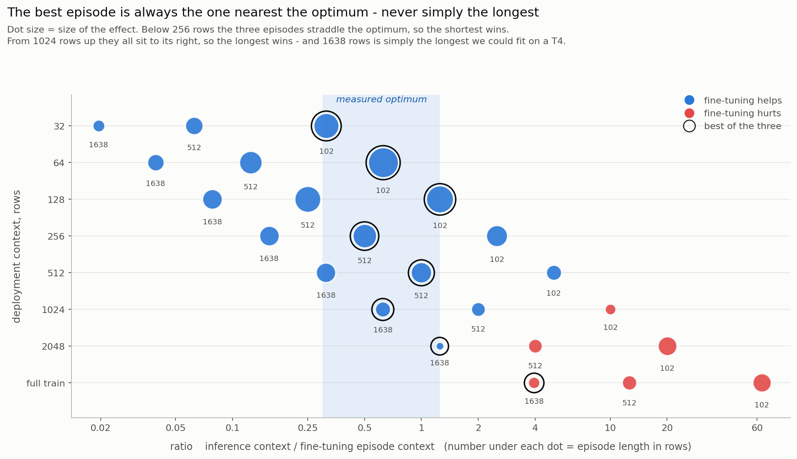

# Mind the ratio

**Fine-tuning TabPFN tunes it to a context length.** What decides whether it helps is
not how much data you fine-tune on, but the ratio between the episode it trains on
and the context it will see when you deploy it.

```
ratio = rows in the inference context / rows in a fine-tuning episode
```

Everything below comes from 24 binary OpenML tasks, three independent runs, 200
gradient steps. **Every number is reproducible in thirty seconds with no GPU** —
the raw measurements are in `data/`, and `notebooks/02_analysis.ipynb` recomputes
the lot:

```bash
pip install -r requirements.txt
jupyter nbconvert --execute --to notebook --inplace notebooks/02_analysis.ipynb
```

---

## The shape



Three fine-tuning episode lengths, swept across every deployment context. Each curve
**rises, peaks between a ratio of 0.1 and 0.6, and crosses into negative past 1 to 4**.
The ratio sets *where* the peak falls; the absolute size of the context sets *how much*
there is to gain, which is why the three curves share a shape but not a height.

## The one table

AUC gained by fine-tuning, against the un-adapted model **at the same context**.
Same 37 dataset-runs in every cell — nothing is averaged across different
populations. `r` is the ratio.

| deploy with ↓ | episode 102 rows | episode 512 rows | episode 1638 rows |
|--:|--:|--:|--:|
| **64** | **+0.0264** `r=0.63` | +0.0142 `r=0.12` | +0.0068 `r=0.04` |
| **128** | **+0.0212** `r=1.25` | +0.0192 `r=0.25` | +0.0104 `r=0.08` |
| **256** | +0.0122 `r=2.51` | **+0.0157** `r=0.50` | +0.0103 `r=0.16` |
| **512** | +0.0054 `r=5.02` | **+0.0114** `r=1.00` | +0.0101 `r=0.31` |
| **1024** | −0.0019 `r=10.0` | +0.0043 `r=2.00` | **+0.0055** `r=0.63` |
| **2048** | −0.0094 `r=20.1` | −0.0042 `r=4.00` | **+0.0002** `r=1.25` |
| **full train** | −0.0088 `r=63.5` | −0.0048 `r=12.7` | **−0.0024** `r=3.96` |

Read it row by row. **In every row the winner is the episode whose ratio is closest
to 0.5 — and the winning column moves right as the deployment context grows.**
The ratios of the seven winners: 0.63, 1.25, 0.50, 1.00, 0.63, 1.25, 3.96.

## When this changes what you do

**1. You deploy with a short context for latency.** Fraud scoring, real-time
ranking, anything where attending over ten thousand rows per request is too slow.
Say you settle on 64 rows of context. Fine-tune with 102-row episodes and you gain
**+0.0264 AUC**; fine-tune with 1638-row episodes — the "more data must be better"
reflex — and you gain **+0.0068**. Same data, same steps, **four times less**,
purely because the episode no longer resembles what the model will see.

**2. Your training set is large.** `tabpfn` caps a fine-tuning episode at 50,000
context+query rows, while inference uses every row you give it. At 200,000 training
rows that is a ratio of 5, and at 400,000 a ratio of 10 — both in the range where
our measurements show fine-tuning doing nothing or actively hurting. Above roughly
100,000 rows the cap needs raising, or the inference context needs bounding. Which
of the two is a memory decision; leaving it unexamined is not.

**3. You hit an out-of-memory error while fine-tuning.** The reflex is to halve the
episode budget and keep everything else. That single change moves you rightwards
across this table, and the bottom-left cells are where the damage is.

## Bigger is not always better

The curve rises and then falls, so "use the longest episode you can afford" is not a
law. It is what you observe when every episode you *can* afford happens to sit on one
side of the optimum.



Read it row by row. The winning episode, ringed, is always the one nearest the shaded
band — never simply the longest.

* **Below 256 rows of deployment context the three episodes straddle the optimum, and
  the shortest wins.** At 64 rows, the 102-row episode gives **+0.0264** against
  **+0.0068** for the 1638-row one: four times more, for a sixteenth of the memory.
* **From 1024 rows upward all three sit to the right of the optimum, so the longest
  wins** — but that is a fact about our grid, not about length. 1638 context rows is
  simply the largest episode a T4 holds on tables of up to 110 features. An episode
  twice as long would land inside the band at a deployment context of 2048, and past
  it beyond.

So "longer is better" holds wherever GPU memory keeps every affordable episode shorter
than the optimum — which is where the published work sits, and where most practitioners
are. It is a consequence of the memory ceiling, not a property of length. Lift the
ceiling and the advice expires.

## Too short is expensive

The two failures are not symmetric, and only one of them damages the model.

**Episode too short relative to the context — the model gets worse than if you had
not fine-tuned at all.** At a ratio of 20 the mean AUC change is **−0.0094** with
only **8 datasets out of 37 improving**; pooled across all runs, beyond a ratio of 8
the relative log-loss is **−5.9%**. You spend GPU time to degrade your model. This
is the failure that matters, and it is the one an out-of-memory workaround walks
straight into.

**Episode longer than needed — you leave gains on the table, but break nothing.**
At the smallest ratio we measured, 0.02, the AUC change is still **+0.0027** and
positive on 26 of 37 datasets. The benefit erodes toward zero; it does not turn
negative. The cost is memory and time, not accuracy.

## What the literature does with these two lengths

Every study we found sets both with a single number, so their ratio never varies and
the effect cannot appear.

| Study | How the two lengths are set | Ratio |
|---|---|---|
| den Breejen et al., [2024](https://arxiv.org/abs/2405.13396) | Support is `min(0.8 × n_train, 8192)`; evaluation uses the whole training set | **1.25**, rising to `n_train/8192` past 10,240 rows |
| den Breejen et al., 2023 (TRL @ NeurIPS) | 80 % split of the same training set used as context at evaluation | **1.25** |
| [LoCalPFN](https://arxiv.org/abs/2406.05207), NeurIPS 2024 | One neighbourhood size `k = min(10√N, 1000)`, shared by both phases | **exactly 1** |
| [Real-TabPFN](https://arxiv.org/abs/2507.03971), 2025 | Training context capped at 20,000 samples, 60 % of it context; evaluated on the AutoML Benchmark | 0.19 – 1.86 depending on the setting |

The 1.25 is not a coincidence: fine-tuning on an 80/20 split and then evaluating with
the *whole* training set as context gives 1/0.8 exactly. Verbatim quotes for each row
are in `notebooks/02_analysis.ipynb`.

## The library's defaults

`notebooks/01_inspect_api.ipynb` reads the installed package and prints file paths and
line numbers. For `tabpfn==9.0.0`:

* `n_finetune_ctx_plus_query_samples = 50000` — a cap on context + query
* `finetune_ctx_query_split_ratio = 0.2`
* `n_inference_subsample_samples = None` — the full training set is the context

Below the cap these give a ratio of exactly **1.25**, inside the band where 65 of 70
dataset-runs improve. That is a good choice, and our measurements support it.

The difficulty is that **the coupling is implicit**. Nothing in the signature says
these parameters must move together, so it survives only while the defaults are left
alone — and it is released in the two situations in the section above: past roughly
100,000 training rows, and whenever the episode budget is lowered to fit in memory.

```python
from ft_window import check, advise

check(n_train=200_000)
# ratio 5.00  (inference context 200,000 rows / episode context 40,000 rows)
# HARMFUL. Episodes are 5x shorter than the context you deploy with. …

advise(n_train=100_000, deployment_context=1_024).kwargs
# {'n_finetune_ctx_plus_query_samples': 2560, 'finetune_ctx_query_split_ratio': 0.2,
#  'n_inference_subsample_samples': 1024}
```

No dependencies, never imports `tabpfn`, uses the library's own parameter names.

## Limits

Binary classification, one model family, one benchmark suite, 200 gradient steps.

The threshold is **a plateau, not a point**: "fine-tune iff ratio ≤ t" scores 77.1 % ±
2.7 out of sample against 67.6 % for "always fine-tune", winning in 200 random splits
out of 200 — but its accuracy is flat for any t between 2.5 and 5, so a single number
would be false precision. `ft_window` takes the conservative end.

**Ratios below 0.1 are only reachable with deployment contexts of 128 rows or fewer**,
because the longest episode we could fit on a T4 is 1638 context rows. The far left of
the curve therefore describes a regime nobody deploys in, and "small ratio" is
confounded with "small context" there. The right-hand side carries no such confound.

**No mechanism.** Out of band, log-loss degrades 7.3× more than AUC does, against 2.2×
inside it, so most of the damage looks like miscalibration rather than lost knowledge.
A single temperature fitted at the deployment context would separate the two — in
binary classification it leaves AUC exactly unchanged. Designed, not run.

## Repository

```
data/          three runs, one CSV each, with a MANIFEST
ft_window/     advise() and check(), no dependencies
tests/         24 unit tests — python -m pytest tests/
notebooks/     01 audit (CPU) · 02 analysis (CPU, English) · 03, 03b, 04 experiments (GPU)
figures/
```

The GPU notebooks carry an English header; their bodies are in French, the language the
research was conducted in. `02_analysis.ipynb`, the one you run, is English throughout.

MIT licensed.
